# Neural Network from Square One

My take on building a Neural Network from the ground up in Python with minimal library usage, based on ['Neural Network from Scratch'](https://nnfs.io). The Neural Network demonstrates a classification task of artificially created data.

Follow step-by-step instructions of creating a Neural Network from square one in */nnfs_steps*.
Important concepts can be found in */concepts*.

---

## Setup

Dependencies are listed in *environment.yml*

* run `conda env create -f environment.yml`
* activate env via `conda activate <env name>`
* run `pip install nnfs`

---

## Neural Network from Square One

Each step builds on previous step and adds a new concept:

01. Neurons and Layers
    01. [Single layer calculation of a Neural Network (NN)](nnfs_steps/01_layer/1-1_nnfs_single-layer01.py)
        * first single layer
    02. [Single layer calculation of a NN](nnfs_steps/01_layer/1-2_nnfs_single-layer02.py)
        * added numpy
    03. [Single layer calculation of a NN](nnfs_steps/01_layer/1-3_nnfs_single-layer03.py)
        * added batch input
    04. [Multi layer calculation of a NN](nnfs_steps/01_layer/1-4_nnfs_multi-layer01.py)
        * added further layer
    05. [Multi layer calculation of a NN](nnfs_steps/01_layer/1-5_nnfs_multi-layer02.py)
        * added OOP
02. Activation Function
    01. [Activation of a NN](nnfs_steps/02_activation/06_nnfs_activation01.py)
        * added activation function for first layer (ReLU)
    02. [Activation of a NN](nnfs_steps/02_activation/07_nnfs_activation02.py)
        * added activation function for output layer (softmax)
03. Loss Function
    01. [Loss calculation of a NN](nnfs_steps/03_loss/08_nnfs_loss.py)
        * added loss function
04. Optimization
    01. [Random optimization of a NN](nnfs_steps/04_optimization/4-1_nnfs_random-optimization.py)
        * added random weights and bias optimization
    02. [Backpropagation of a NN](nnfs_steps/04_optimization/4-2_nnfs_backpropagation.py)
        * added backpropagation through layers
    03. [SGD optimization of a NN](nnfs_steps/04_optimization/4-3_nnfs_stochastic-gradient-descent.py)
        * added Stochastic Gradient Descent as parameter (weights and biases) optimizer
    04. [SGD optimization of a NN](nnfs_steps/04_optimization/4-4_nnfs_learning-rate-decay.py)
        * added learning rate decay to SGD optimizer
    05. [SGD optimization of a NN](nnfs_steps/04_optimization/4-5_nnfs_momentum.py)
        * added momentum to SGD optimizer
    06. [AdaGrad optimization of a NN](nnfs_steps/04_optimization/4-6_nnfs_adaptive-gradient-descent.py)
        * added Adaptive gradient as parameter (weights and biases) optimizer
    07. [RMSprop optimization of a NN](nnfs_steps/04_optimization/4-7_nnfs_root-mean-square-prop.py)
        * added Root Mean Square Propagation as parameter (weights and biases) optimizer
    08. [Adam optimization of a NN](nnfs_steps/04_optimization/4-8_nnfs_adaptive-momentum.py)
        * added Adaptive Momentum as parameter (weights and biases) optimizer
05. Regularization
    01. [L1 and L2 regularization of a NN](nnfs_steps/05_regularization/5-1_nnfs_regularization-l1-l2.py)
        * added L1 and L2 regularization of generalization error
06. Dropout Layer
    01. [Dropout layer of a NN](nnfs_steps/06_dropout/6-1_nnfs_dropout-layer.py)
        * added dropout layer
07. Binary Logistic Regression
    01. [Binary logistic regression of a NN](nnfs_steps/07_regression/7-1_nnfs_binary-log-regression.py)
        * added binary logistic regression for binary classification
    02. [Linear logistic regression of a NN](nnfs_steps/07_regression/7-2_nnfs_linear-regression.py)
        * added linear regression scalar prediction

---

## Concepts
The purpose of the concepts is to better understand changes in the different steps and add detailed explanations.

* [Log](concepts/01_log.py)
* [Loss](concepts/02_loss.py)
* [Accuracy](concepts/03_accuracy.py)
* [Backpropagation Single Neuron](concepts/04_backpropagation_single-neuron.py)
* [Backpropagation Single Layer](concepts/05_backpropagation_single-layer.py)
* [Backpropagation Single Layer w optimization](concepts/06_backpropagation_single-layer_optimization.py)
* [Softmax Derivative and Jacobian matrix](concepts/07_softmax_derivative.py)
* [Stochastic Gradient Descent Optimizer](concepts/08_stochastic_gradient_descent.py)
* [Optimizer Learning Rate](concepts/09_learning_rate.py)
* [Regularization](concepts/10_regularization.py)
* [Dropout](concepts/11_dropout.py)

---

## Assets

 

**max() => ReLU activation derivative**

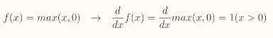

 

**Categorical Cross-Entropy loss derivative**

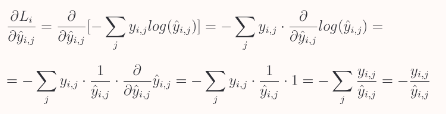

> i — i-th sample in a set
>
> j — label/output index
> 
> Li — sample loss value
> 
> y — target values
>
> y-hat — predicted values

 

**Softmax activation derivative**

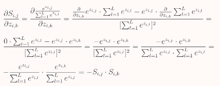

> L — number of inputs
>
> Si,j — j-th Softmax’s output of i-th sample
>
> z — input array which is a list of input vectors (output vectors from the previous layer)
> 
> zi,j — j-th Softmax’s input of i-th sample
> 
> zi,k — k-th Softmax’s input of i-th sample

 

**Common Categorical Cross-entropy loss and Softmax activation derivative**

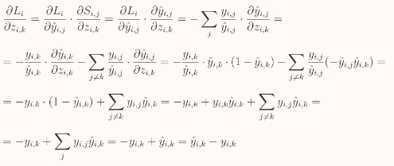

> i — i-th sample in a set
>
> j — label/output index
> 
> k — index of the target label (ground-true label)
>
> Li - sample loss value
>
> Si,j — j-th Softmax’s output of i-th sample
>
> y — target values
>
> y-hat — predicted values
>
> z — input array which is a list of input vectors (output vectors from the previous layer)
>
> zi,j — j-th Softmax’s input of i-th sample
>
> zi,k — k-th Softmax’s input of i-th sample

 

**L1 regularization derivative**

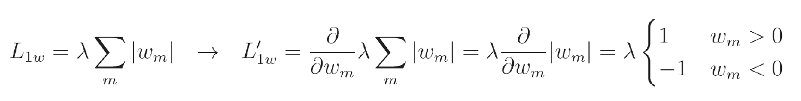

> λ — regularization strength hyperparameter
>
> m (alternatively n) — iterator over all weights in a model (alternatively iterator over all biases in a model)
>
> w (alternatively b) — layer weights (alternatively layer biases)

 

**L2 regularization derivative**

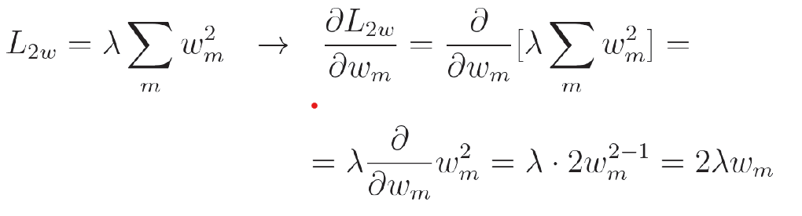

> λ — regularization strength hyperparameter
>
> m (alternatively n) — iterator over all weights in a model (alternatively iterator over all biases in a model)
>
> w (alternatively b) — layer weights (alternatively layer biases)

**Dropout derivative**

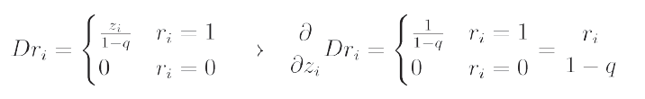
> i — index of given input (and layer output)
>
> q — dropout rate
>
> r — neuron's input
>
> z — neuron's output

**Sigmoid derivative**

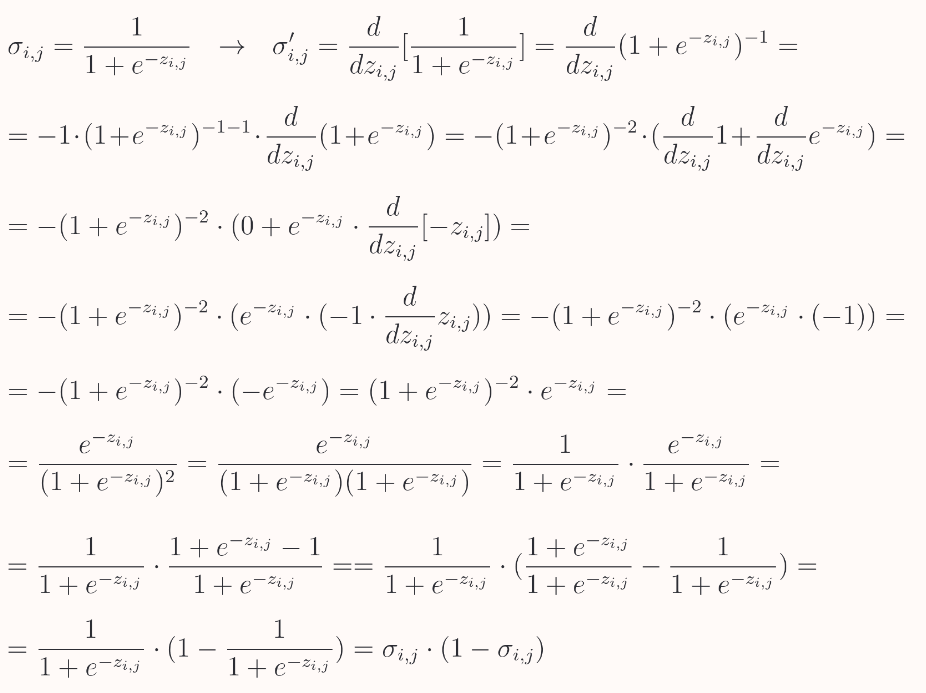

> i — i-th sample in a set
>
> j — label/output index
>
> z — singular output value of the layer that this activation function takes as input

**Binary Cross-entropy loss derivative**

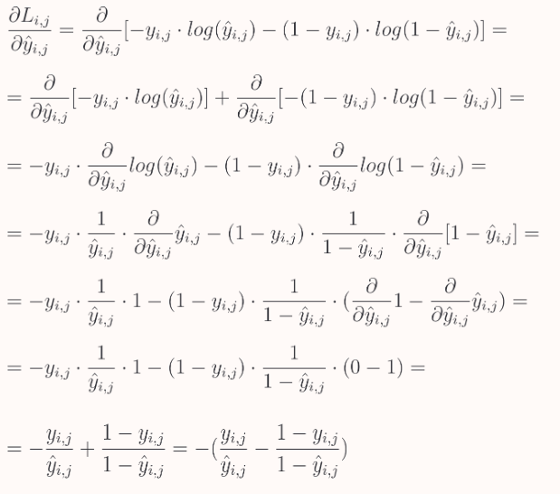

> i — i-th sample in a set
>
> j — label/output index
>
> y — target values
>
> y-hat — predicted values

**Mean squared error loss derivative**

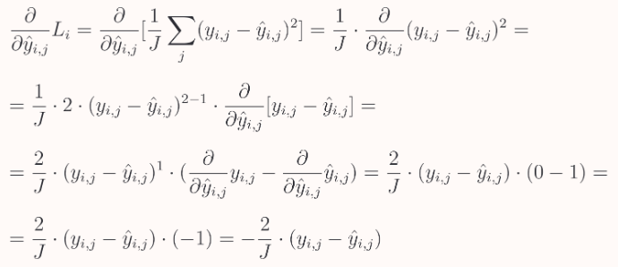

> i — i-th sample in a set
>
> j — label/output index
>
> y — target values
>
> y-hat — predicted values

**Mean absolute error loss derivative**

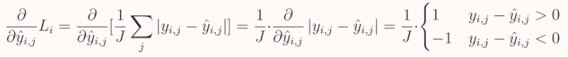

> i — i-th sample in a set
>
> j — label/output index
>
> y — target values
>
> y-hat — predicted values

---

#### *based on ['Neural Network from Scratch'](https://nnfs.io)*
